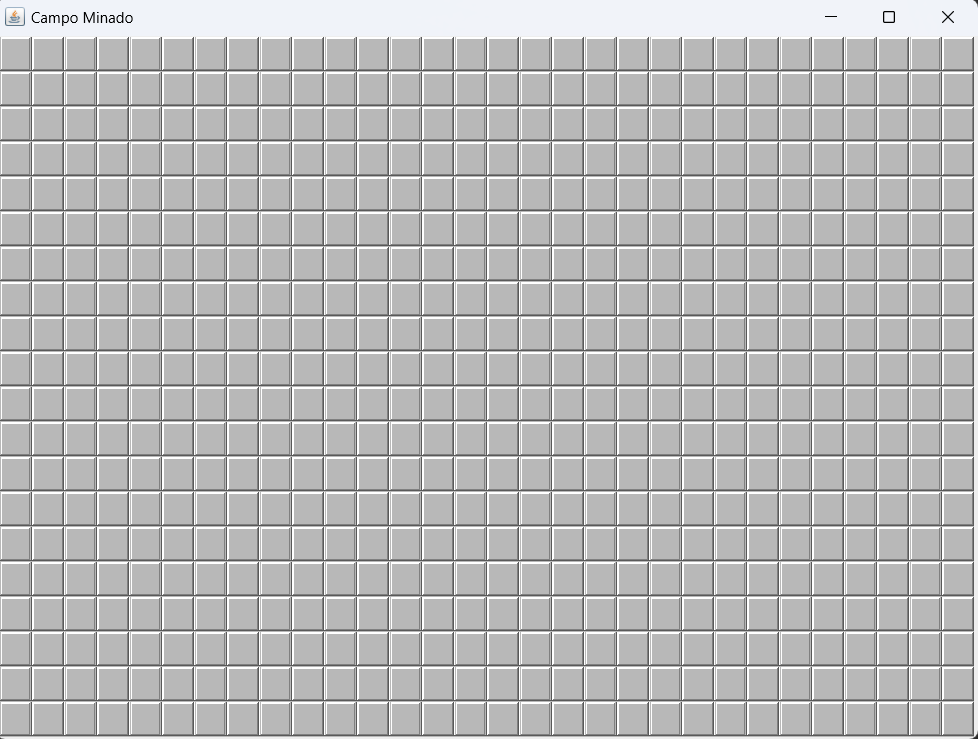
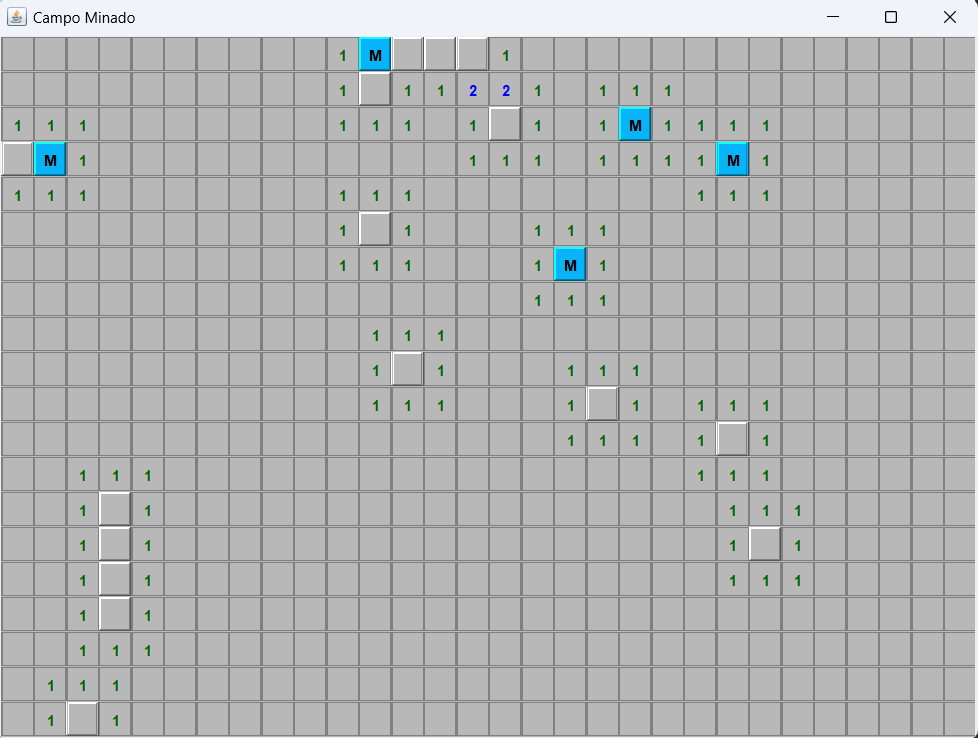
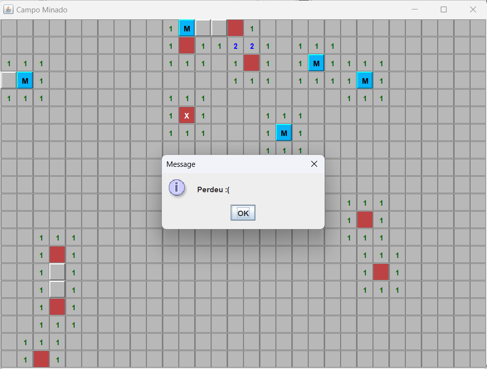
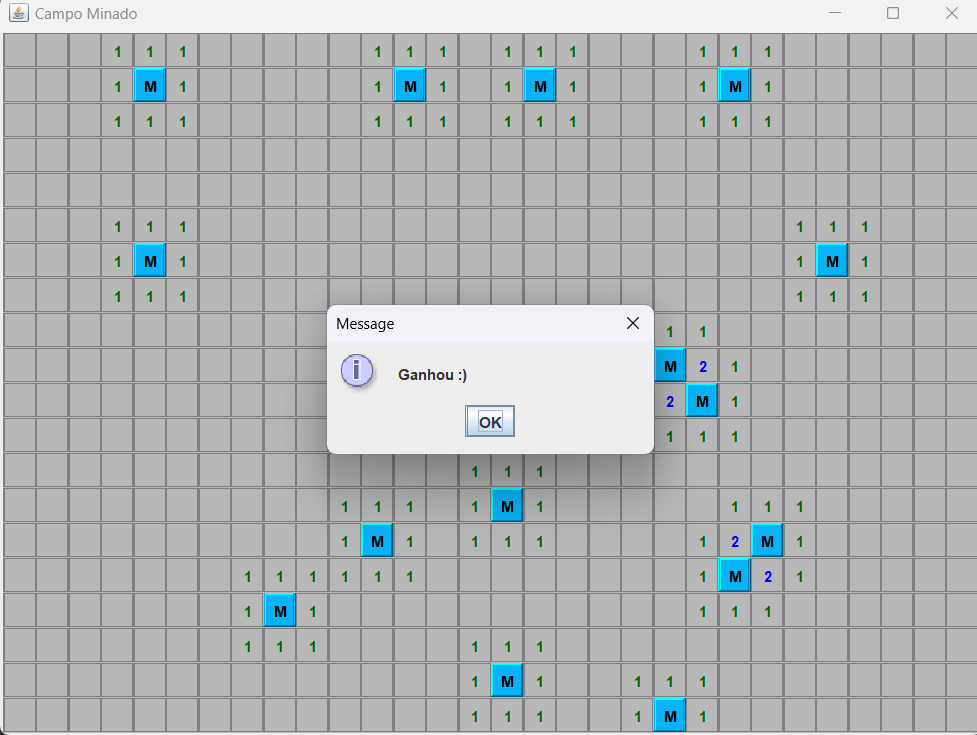

# PROJETO - Campo Minado usando Java Swing

- Projeto simples desenvolvido em Java para fins de estudo da lib Swing.
- O projeto é uma versão do clássico jogo Campo Minado (Minesweeper)
- Seguem abaixo amostras do sistema:

 
 

 
 

 
 

 
 

 

---